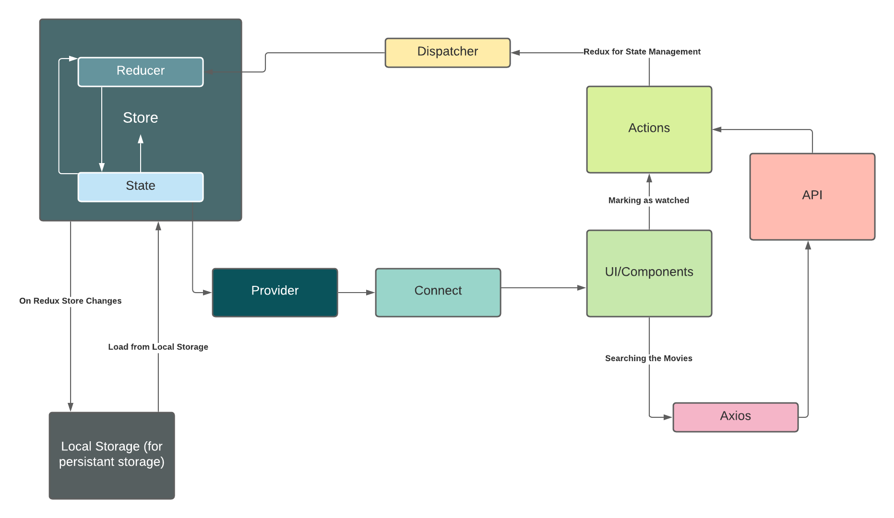

# Martin's Movies

##### By:
#### Shelby El-rassi | [GitHub](https://github.com/Shelby219) |

---

---

### Brief

Martin's Movies is a client who reviews movies online. They have moved all of their movies to an online movie database which is only accessible via an API.

They need to:
- build a new listing page to pull all data from their new database
- allow customers to search by different movie attributes which are:
- Keyword
- language (English or Other)
- year
- mark a movie as 'watched' so when they open the listing page again in the same browser it will still be marked as 'watched'

Martin's Movies would like to link the Read More button for each movie off to the IMDB page if the imdb_id is set for a movie.

He would like the design to match a theme he liked but make all make all links a dead link (eg x) for now:

http://klbtheme.com/movify/movie-grid-3/

Deliverables:
- a ReactJS App broken up as you see fit
- feel free to use Redux for state management if need be
- feel free to use any supporting libraries (NPM/Bower)

We are using The Movie Database which is located here:

https://developers.themoviedb.org/3/getting-started/introduction

-----
### User Stories

* As a user:
    * I can go to the home page and search for movies (titles) by:
        * Keyword
        * language (English or Other)
        * year
    * I will be taken to the search page after typing a valid parameter and clicking search and will view all matching movies.
    * I will be taken to a no results page after typing an invalid parameter and clicking search.
    * I can go to a 'All Movies" page and view all the movies sorted by popularity.
    * I can mark a movie as watched.
    * I can unmark a movie as watched.
    * I will be able to click a "Read More" button on a movie listing on the results page and be taken to IMBD if ID present.

-----

### Target Audience

**Key Demographics**
* **Gender**: Anyone.
* **Age**: 18-50.
* **Family status**: Single, couple or family.
* **Profession**: Students, professionals, homemakers, retired.
* **Language**: English for the site, but ability to search other options.
* **Main interests**: Movies, pop culture.

**Key Psychographics**
* Wants to find out if a movie is good before watching.
* Dislikes mediocre choices.
* Enjoys other opinions on movies.

**Challenges**
* Finds choosing movies difficult.
* Wants to keep track of movies watched.
* Would like to know movies that are available in languages other than English.

**Preferred Channels**
* Follows celebrity actors/actresses on social media.
* Searches for movies on Google.

**Preferred Content Types**
* Social media posts.
* Blogs.
* News Articles.

-----

### Tech Stack

**Design and Planning**
* **Lucid Chart**- Diagramming.

**Tech**
* **React 17.0.1** - An open-source, front end, JavaScript library for building user interfaces or UI components.
* **React-dom 17.0.1** - This package serves as the entry point to the DOM and server renderers for React.
* **React-router-dom 5.2.0** - React Router is a collection of navigational components that compose declaratively with your application, DOM bindings for React Router.
* **React-scripts 4.0.1** - Includes scripts and configuration used by Create React App used to initiate the project.
* **React-redux 7.2.2** - Is the official React binding for Redux. It lets your React components read data from a Redux store, and dispatch actions to the store to update data.
* **@reduxjs/toolkit** - Is the official, opinionated, batteries-included toolset for efficient Redux development, intended to be the standard way to write Redux logic. It includes utility functions and several Redux add ons.
* **Dotenv 8.2.0** -  is a module that loads environment variables from a .env file into process.env. Storing configuration in the environment separate from code is based on the Twelve-Factor App methodology.
* **React-styled-components** - is a library for React and React Native that allows you to use component-level styles in your application that are written with a mixture of JavaScript and CSS using a technique called CSS-in-JS.
* **Material UI** - Is the most popular React framework, it enables using React components faster development or building a custom design.
* **HTML5**  - A markup language used for structuring and presenting content.
* **CSS3** - A style sheet language used for describing the presentation of a document
* **Axios** - Is a promise-based HTTP client that supports an easy-to-use API and can be used in both the browser and Node. js.
* **The Movie DB API** - An API which has to service of fetching movie, TV and actor images and data.

**Other**
* **Netlify**  - Is a serverless platform enabling intuitive git-based workflows and automated deployments. Heroku was my first choice for deployment, but due to time I chose Netlify as I had had used all my Heroku Apps available on the payment tier I was on.
* **GitHub** - Is a provider of Internet hosting for software development and version control using Git and it was my Version Control Host.
* **Images** - KLB theme images.
* **The Movie DB** - The Movie Database API for all the movie data and search queries.

-----

### Functionality/Features

###### Current
* Home page
* Search for movie titles via keyword, language and year.
* View movie data via results page.
* View all movie data via all movies page.
* Movie listing:
    * Title
    * Overview
    * Image
    * Vote average. eg 6/10
    * Year
* Mark movie as watched.
* Unmark movie as watched.
* "Read More" button linking to IMDB if ID present.

###### Upcoming
* Search for movies by movie year and language available.

-----

### Testing

* Manual testing via the console
* Development user testing using local host
* Production user testing once deployed

-----

### Data Flow Diagram

###### A diagram showing the flow flow of the data stored in Local state via Redux.

-----

### Implementation Plan

* Documentation
* File Architecture Set up
* Redux Set up
* Page base code
* Component Base Code
* Functionality of components using test data
* Tested API endpoints via postman to determine if suitable
* Axios and services to input real data
* Connecting of redux for saved state
* Manual Testing
* Styling using a mixture of Styled-Components, material UI 'makeStyles()' and in-line styling.
* Automated testing using Cypress.... TBA

-----

### Development Log

* **28th January 2021**
    * Received Client Brief and review client requirements. Along with reviewing the design requirements.
    * Researched and reviewing the movie API, begun some simple test points with Postman.
    * Begun documentation.
        * User Stories.
        * Target Audience.
        * Tech stack and library information.
        * Functionality and features.
        * Data flow Diagram.
    * Once documentation was at a good starting point, I began coding.
    * Initialized create-react-app.
    * Set up the file architecture.
    * Set up the page and components function frameworks.
    * Began creating the base for the nav bar.
    * Add some test data for the movie listings page.

    * **Blockers**
        * Determining if design brief had to be exact, or inspired.

 

* **29th January 2021**
    * Received notes that design is to match the basis site, so I began reviewing the nav bar and adjusting the styling and set up accordingly.
    * Continued researching the movie API, and tested endpoints via postman.
    * Discovered that some movies have titles and some have names, so if the search returns name then that will be used in rendering the movie.
    * Created a function which filters the movies genre code from the DB and returns the correct genre from a JSON file which houses the codes and names.
    * Implemented Material UI.
    * Created the framework styling and layout for home page with search bar and movie listings page with movie cards.

    * **Blockers**:
        * Determining if Material UI Grid was better or pur CSS via flexbox.

 

* **31st January 2021**
    * Redux storage for movies implemented.
    * Redux storage for watched movies implemented.
    * Local storage for saving watched movies implemented.
    * Local storage for movie searched implemented.
    * Update search bar- by searching with 3 inputs, keywords, language and year, with validation on all 3.
    * Restructure search bar to be separate components and added on change and handle submit for search.
    * Added autocomplete components for language options, using JSON file from the API, not sure if implementing yet.
    * **Blockers**:
        * Determining how to store "watched or unwatched for each movie" whilst using API calls to get the movies via search, being able to store a watched reference. This was overcome by using Redux storage to store a array of MOVIES_WATCHED just storing the movies ID and a watched boolean. Then when displaying the movies returned from the Axios call, using a function to check if the movie is watched in storage before displaying.
        * Environment Variable Issues. Created a customer APIKEY enviroment variable for development, had some issues due to the 'create-react-app' configuration which requires all .env variables to start with "REACT_APP_".

* **1st February 2021**
    * Query parameters for the search results page input.
    * Initial Deployment
    * All movies page completed, with pagination for all movie listings up to 500 per the API - the data for this page was held with 'useState' over redux, possibly more efficient?
    * Added pagination to the search page.
    * Marking as watched process begun, can mark as watched and add to redux.
    * Marked as unwatched in state set up.
    * Successful for the search results page keeping "watched" state for checked boxes. This was done by adding a new object property to the movie data displayed on the page, using the ID in the 'MOVIES WATCHED' stored array and if present adding the 'watched' property to the array of objects.
    * IMDB API endpoint set up, when the user clicks on Readmore it will make an API request to get the IMDB ID to send the user to IMDB.
    * **Blockers**:
        * Pagination for all listings page was set up smoothly, just issues with setting the current page loading time a bit slow, so clicking over pages loads old data, then refreshing loads correct page.... This was resolved by changing how the main axios call was made, correct in a useEffect, with the useEffect being called every time the page number changes.
        * Determining how to go about the search bar for keyword, year OR language. 3 inputs? Checkboxes which determine the input? On search bar that has validation behind the scenes determining? Using data for a autocomplete dropbox for languages?
        * Issues with the content from search being overridden by Local storage, therefore leaving the page empty. This happened in process of marking as watched. This was resolved.
        * Stuck on comparing two arrays of objects, one being the movie data, the other being the watched movie array. Checking if the ID is in watched to enable to checkbox to stay ticked.
        * Extra Validation needed for marking watched in redux.

* **2nd February 2021**
   * Tidied up readme
   * Hover effect on nav bar
   * Added a search icon to the nav bar for added UX
   * Final deployment

-----

### Getting Started with Create React App

This project was bootstrapped with [Create React App](https://github.com/facebook/create-react-app).

#### Available Scripts

In the project directory, you can run:

#### `yarn start`

Runs the app in the development mode.\
Open [http://localhost:3000](http://localhost:3000) to view it in the browser.

The page will reload if you make edits.\
You will also see any lint errors in the console.

#### `yarn test`

Launches the test runner in the interactive watch mode.\
See the section about [running tests](https://facebook.github.io/create-react-app/docs/running-tests) for more information.

#### `yarn build`

Builds the app for production to the `build` folder.\
It correctly bundles React in production mode and optimizes the build for the best performance.

The build is minified and the filenames include the hashes.\
Your app is ready to be deployed!

See the section about [deployment](https://facebook.github.io/create-react-app/docs/deployment) for more information.

#### `yarn eject`

**Note: this is a one-way operation. Once you `eject`, you can’t go back!**

If you aren’t satisfied with the build tool and configuration choices, you can `eject` at any time. This command will remove the single build dependency from your project.

Instead, it will copy all the configuration files and the transitive dependencies (webpack, Babel, ESLint, etc) right into your project so you have full control over them. All of the commands except `eject` will still work, but they will point to the copied scripts so you can tweak them. At this point you’re on your own.

You don’t have to ever use `eject`. The curated feature set is suitable for small and middle deployments, and you shouldn’t feel obligated to use this feature. However we understand that this tool wouldn’t be useful if you couldn’t customize it when you are ready for it.

#### Learn More

You can learn more in the [Create React App documentation](https://facebook.github.io/create-react-app/docs/getting-started).

To learn React, check out the [React documentation](https://reactjs.org/).

#### Code Splitting

This section has moved here: [https://facebook.github.io/create-react-app/docs/code-splitting](https://facebook.github.io/create-react-app/docs/code-splitting)

#### Analyzing the Bundle Size

This section has moved here: [https://facebook.github.io/create-react-app/docs/analyzing-the-bundle-size](https://facebook.github.io/create-react-app/docs/analyzing-the-bundle-size)

#### Making a Progressive Web App

This section has moved here: [https://facebook.github.io/create-react-app/docs/making-a-progressive-web-app](https://facebook.github.io/create-react-app/docs/making-a-progressive-web-app)

#### Advanced Configuration

This section has moved here: [https://facebook.github.io/create-react-app/docs/advanced-configuration](https://facebook.github.io/create-react-app/docs/advanced-configuration)

#### Deployment

This section has moved here: [https://facebook.github.io/create-react-app/docs/deployment](https://facebook.github.io/create-react-app/docs/deployment)

#### `yarn build` fails to minify

This section has moved here: [https://facebook.github.io/create-react-app/docs/troubleshooting#npm-run-build-fails-to-minify](https://facebook.github.io/create-react-app/docs/troubleshooting#npm-run-build-fails-to-minify)
